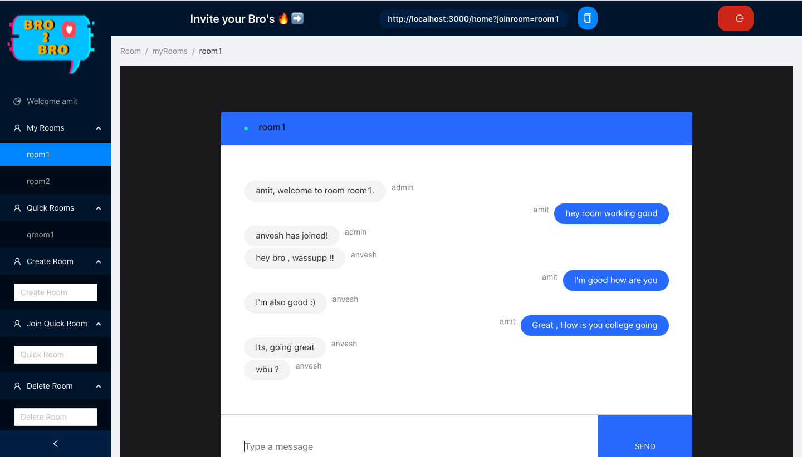

# **BRO2BRO**

Bro2Bro is a room based MERN chat application that lets you securely chat with your friends with the click of a button.\
This project was bootstrapped with [Create React App](https://github.com/facebook/create-react-app).

## `Features of BRO2BRO`

* Secure authentication using [passport.js](http://www.passportjs.org),[JWT](https://www.npmjs.com/package/passport-jwt)  and [react-cookie](https://www.npmjs.com/package/react-cookie).
* Real time chatting with rooms using socket.io.
* Easily create, delete and join your rooms.
* You can create 2 types of rooms :
    * **MyRoom** : messages are saved if you chat with these. and room persists even if you log out.
    * **QuickRoom** : messeges are not saved and room dies once session ends or you refresh.
* Every room provides you with a joining URL which you can share with your friends to make them join.
* UI comprises of custom and antd components.

## `How to Use`

/home

* Once you log in you can see the following screen.

* To create a `myRoom` go to `create room` tag on left , type your room name and and press enter.you room will be created under `My Rooms` tag.
* To create a `quickRoom` go to `Join Quick Room` tag on left, type your room name and and press enter.you room will be created under `Qucik Rooms` tag.
* To join a room , click on its name under the respective tag.
* Once joined you can copy the joining URL at top and share with friends.
* To delete a `myRoom` go to `delete room` tag on left , type the room name and and press enter.you room will be deleted.

## `Note`
* `quickRooms` and `myRooms` cannot have same name.
  

## Available Scripts

In the project directory go to the client folder by `cd client` and server folder by `cd server` and do `npm install` to get the node modules.

inside `client` you can run 

### `npm start`

Runs the app in the development mode.\
Open [http://localhost:3000](http://localhost:3000) to view it in the browser.

The page will reload if you make edits.\
You will also see any lint errors in the console.

### `npm test`

Launches the test runner in the interactive watch mode.\
See the section about [running tests](https://facebook.github.io/create-react-app/docs/running-tests) for more information.

### `npm run build`

Builds the app for production to the `build` folder.\
It correctly bundles React in production mode and optimizes the build for the best performance.

The build is minified and the filenames include the hashes.\
Your app is ready to be deployed!

See the section about [deployment](https://facebook.github.io/create-react-app/docs/deployment) for more information.

### `npm run eject`

**Note: this is a one-way operation. Once you `eject`, you can’t go back!**

If you aren’t satisfied with the build tool and configuration choices, you can `eject` at any time. This command will remove the single build dependency from your project.

Instead, it will copy all the configuration files and the transitive dependencies (webpack, Babel, ESLint, etc) right into your project so you have full control over them. All of the commands except `eject` will still work, but they will point to the copied scripts so you can tweak them. At this point you’re on your own.

You don’t have to ever use `eject`. The curated feature set is suitable for small and middle deployments, and you shouldn’t feel obligated to use this feature. However we understand that this tool wouldn’t be useful if you couldn’t customize it when you are ready for it.

## Learn More

You can learn more in the [Create React App documentation](https://facebook.github.io/create-react-app/docs/getting-started).

To learn React, check out the [React documentation](https://reactjs.org/).

### Code Splitting

This section has moved here: [https://facebook.github.io/create-react-app/docs/code-splitting](https://facebook.github.io/create-react-app/docs/code-splitting)

### Analyzing the Bundle Size

This section has moved here: [https://facebook.github.io/create-react-app/docs/analyzing-the-bundle-size](https://facebook.github.io/create-react-app/docs/analyzing-the-bundle-size)

### Making a Progressive Web App

This section has moved here: [https://facebook.github.io/create-react-app/docs/making-a-progressive-web-app](https://facebook.github.io/create-react-app/docs/making-a-progressive-web-app)

inside `server` you can run 

### `nodemon index.js`

Runs the server in the development mode at [http://localhost:4000](http://localhost:4000)

once the server and client are up and running you can go to [http://localhost:3000/register](http://localhost:3000/register) to start using the app.

